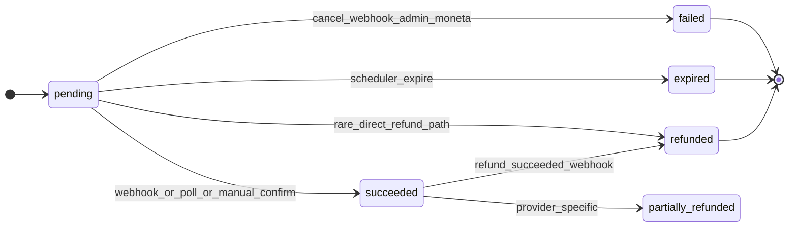
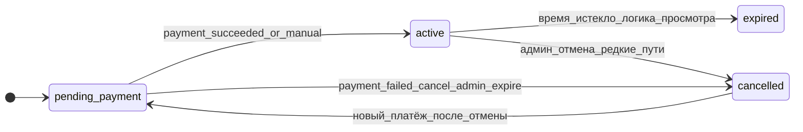
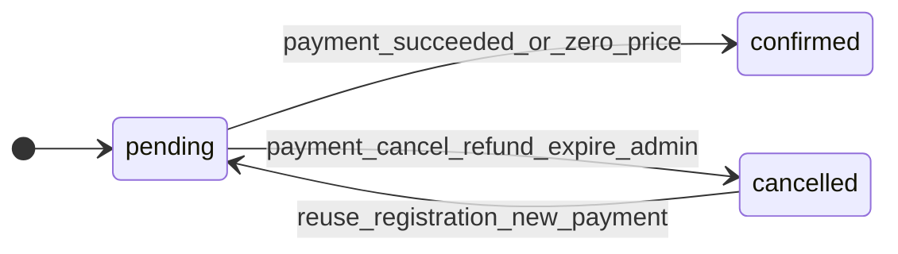
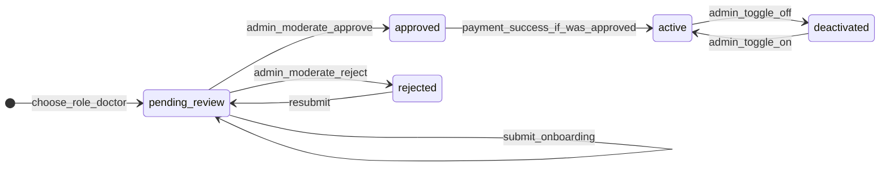
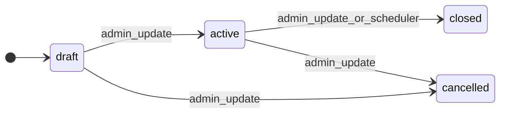

# Бизнес-сценарии (QA-флоу по коду бэкенда)

Документ восстановлен по сервисному слою, моделям и роутерам в `backend/app`. Enum’ы статусов: [`app/core/enums.py`](../backend/app/core/enums.py). Матрица HTTP: [`API_ENDPOINT_MATRIX.md`](API_ENDPOINT_MATRIX.md). Доп. QA-матрица нетривиальных веток: [`QA_NONTRIVIAL_EDGE_CASES.md`](QA_NONTRIVIAL_EDGE_CASES.md).

**Шаблон сценария** (ниже каждый блок следует ему):

- **Триггер** — кто и откуда (API / webhook / cron / TaskIQ).
- **Шаги** — запрос → условие → результат → дальше.
- **БД** — сущности и поля/статусы.
- **Внешние системы** — провайдер, email, Telegram, S3 и т.д.
- **Ветки** — happy path / ошибки.
- **Поллинг / идемпотентность** — при необходимости.

---

## 1. Конечные автоматы (состояния в БД)

### 1.1 `Payment` (`payments.status` → `PaymentStatus`)

Примечания по коду:

- `handle_moneta_payment_succeeded` / `_apply_payment_succeeded`: если уже `succeeded`, повторный выход **без изменений** (идемпотентно).
- `REFUNDED`: в основном через `_handle_refund_succeeded` (YooKassa webhook / inbox).

### 1.2 `Subscription` (`subscriptions.status` → `SubscriptionStatus`)

- При успешной оплате взноса: `_activate_subscription` ставит `active`, выставляет `starts_at` / `ends_at` (продление от предыдущего `ends_at`, если оно в будущем).
- `poll_pending_moneta_payments`: при `CANCELED`/`REVERSED` в Moneta — `payment.failed`, подписка `pending_payment` → `cancelled`.
- `expire_stale_pending_payments`: `payment.expired`, подписка `pending_payment` → `cancelled`.

### 1.3 `EventRegistration` (`event_registrations.status`)

- Уникальность `(user_id, event_id, event_tariff_id)` — повторная «новая» регистрация даёт **409** (`ConflictError` / `IntegrityError`).

### 1.4 `DoctorProfile` (`doctor_profiles.status` → `DoctorStatus`)

- После успешной оплаты членства: если профиль `approved` → `active` (`_activate_subscription`).
- Админ `toggle_active`: явно `active` / `deactivated`.

### 1.5 `VotingSession` (`voting_sessions.status`)

- Планировщик `close_expired_voting_sessions`: `active` + `ends_at < now` → `closed`.

### 1.6 `Receipt` (`receipts`)

- Уникальность `(payment_id, receipt_type)` — один чек оплаты и один возврата на платёж.
- Moneta receipt webhook: создаёт или обновляет строку, `status` → `succeeded` при URL.

### 1.7 `Event` (`events.status`)

- Регистрация разрешена при `upcoming` и `ongoing` (гостевой поток); иначе бизнес-ошибка.

---

## 2. Сводка: поллинг и идемпотентность

| Сценарий | Поллинг для фронта | Идемпотентность |
|----------|-------------------|-----------------|
| Оплата взноса после редиректа Moneta | `GET /api/v1/subscriptions/payments/{id}/status` (без JWT) | Повтор `POST /subscriptions/pay` с тем же `idempotency_key` + Redis `idempotency:pay:{user}:{key}`; уникальный `payments.idempotency_key` |
| Подтверждение без webhook | `POST /api/v1/subscriptions/payments/{id}/check-status` (JWT doctor, свой платёж) | Повтор при уже `succeeded`: сервис возвращает `changed: false` |
| Moneta Pay URL webhook | Фронт может не поллить, если webhook стабилен | Redis `webhook:dedup:moneta:{MNT_OPERATION_ID}` — повтор → сразу `SUCCESS` без повторной обработки |
| YooKassa legacy webhook | Аналогично | Redis dedup по событию + external_id; повтор `_apply_payment_succeeded` без эффекта при `succeeded` |
| YooKassa v2 inbox | Ожидание обработки TaskIQ; фронт всё ещё может поллить статус платежа | Redis prefix `v2:{event}:{id}` + уникальный `(provider, external_event_key)` в `payment_webhook_inbox` |
| Голосование | Нет | `UNIQUE (voting_session_id, user_id)` на `votes`; повтор → **409 Conflict** |
| Регистрация на событие | Поллинг статуса платежа по `payment_id` | `idempotency_key` на создаваемом `Payment`; уникальность регистрации |
| Гостевая верификация email | Нет | Redis код + лимиты попыток/отправок |

Фоновые fallback без UI: `poll_pending_moneta_payments` (каждые ~30 с), `expire_stale_pending_payments` (~30 мин), `retry_stale_webhook_inbox_rows`, `close_expired_voting_sessions`.

---

## 3. Платежи и членство

### 3.1 Инициация оплаты взноса (`POST /api/v1/subscriptions/pay`)

**Триггер:** пользователь с ролью `doctor`, JWT.

**Шаги:**

1. **Запрос** — `plan_id`, `idempotency_key`.
2. **Redis** — ключ `idempotency:pay:{user_id}:{key}`: если есть JSON и платёж всё ещё `pending` и не истёк — **вернуть кэш** (тот же `payment_url`).
3. **БД** — по `(user_id, idempotency_key)` найти `Payment` в `pending` и не истёкший → вернуть тот же ответ, обновить Redis.
4. **Проверки** — план активен; есть `DoctorProfile`; `has_medical_diploma`; продукт `entry_fee`+план или только подписка (`subscription_helpers.determine_product_type`).
5. **БД** — создать `Subscription` со статусом `pending_payment`; создать `Payment` `pending`, `subscription_id`, `expires_at`, привязка к провайдеру.
6. **Внешнее** — `create_payment_via_provider` (Moneta/YooKassa): заполнить `external_payment_id`, `external_payment_url`, для Moneta — появится `moneta_operation_id` после ответа провайдера (через `apply_create_payment_result`).
7. **Ответ** — `payment_id`, `payment_url`, `expires_at`.
8. **Ошибка провайдера** — `rollback` транзакции, **422** `AppValidationError`.

**Ветки:**

- **404** — нет профиля / план не найден.
- **422** — нет диплома, не настроен entry fee, ошибка API провайдера.
- Повтор с тем же ключом после истечения `expires_at` — новая попытка (кэш сбрасывается).

**Идемпотентность:** см. таблицу §2.

### 3.2 Подтверждение оплаты — Moneta Pay URL (`GET|POST /api/v1/webhooks/moneta`)

**Триггер:** Moneta (без JWT).

**Шаги:**

1. Собрать query/form параметры; залогировать.
2. **Redis dedup** `webhook:dedup:moneta:{MNT_OPERATION_ID}`: если ключ уже есть → **200 `SUCCESS`** (идемпотентно).
3. Верификация подписи `MonetaPaymentProvider.verify_webhook`.
4. Ветка **CANCELLED_DEBIT / CANCELLED_CREDIT** — найти `Payment` по UUID из transaction id, `_handle_payment_canceled`, **SUCCESS**.
5. Иначе успешная оплата — `Payment` по id, записать `moneta_operation_id`, `PaymentWebhookService.handle_moneta_payment_succeeded` → `_apply_payment_succeeded` (без YooKassa-like receipt, без user Telegram из этого пути).
6. Ошибки обработки — **FAIL**, при необходимости снять dedup-ключ для ретрая.

**БД при успехе:** см. §3.6.

**Внешнее:** Moneta; после успеха — TaskIQ email/Telegram (см. `_apply_payment_succeeded`), генерация сертификата при `DoctorProfile.active`.

### 3.3 Moneta Check URL (`GET|POST /api/v1/webhooks/moneta/check`)

**Триггер:** Moneta до оплаты.

**Шаги:** проверка подписи; XML-ответ с кодами Moneta (`MonetaCheckResultCode`); при наличии платежа и `MNT_OPERATION_ID` — обновить `payment.moneta_operation_id` (+ commit в обработчике).

**БД:** в основном чтение + возможное обновление `payments.moneta_operation_id`.

### 3.4 Moneta receipt (`POST /api/v1/webhooks/moneta/receipt`)

**Триггер:** Moneta (секрет/IP по `is_moneta_receipt_webhook_authorized`).

**Шаги:** найти `Payment` по `moneta_operation_id`; upsert `Receipt` (`payment` / `refund`); **email** `send_receipt_available_notification`, **Telegram** `notify_user_receipt_available` при наличии URL.

**Идемпотентность:** обновление существующей строки `Receipt` по `(payment_id, receipt_type)`.

### 3.5 YooKassa legacy (`POST /api/v1/webhooks/yookassa`)

**Триггер:** YooKassa, IP allowlist, rate limit.

**Шаги:** Redis dedup по событию и `external_id`; `SubscriptionService.handle_webhook` → `PaymentWebhookService.handle_webhook`: поиск платежа по `external_payment_id` или `metadata.internal_payment_id`; события `payment.succeeded` (опционально проверка API YooKassa), `payment.canceled`, `refund.succeeded`.

**БД:** как в §3.6 для succeeded/canceled/refund.

### 3.6 Общий успех платежа (`_apply_payment_succeeded`)

**БД:**

- `payments`: `status=succeeded`, `paid_at=now`.
- Если `product_type` в `entry_fee` / `subscription`: `_activate_subscription` — `subscriptions.status=active`, даты; если профиль `approved` → `doctor_profiles.status=active`.
- Если `event`: `event_registrations.status=confirmed`.
- Опционально строка `receipts` (YooKassa с объектом чека в webhook).

**После commit (TaskIQ):**

- Взнос/подписка: `send_payment_succeeded_notification`, `notify_admin_payment_received`, `notify_user_payment_succeeded` (для Moneta success из Pay URL — **без** user payment telegram, т.к. ждём receipt flow).
- Событие: `send_event_ticket_purchased`, `notify_user_event_ticket`.
- Сертификат: `generate_member_certificate_task` если врач уже `active`.

### 3.7 Отмена / возврат платежа (webhook)

- `_handle_payment_canceled`: `payment.failed`; для события — `_cancel_event_registration` (`registration.cancelled`, `seats_taken--`); email `send_payment_failed_notification`, Telegram `notify_user_payment_failed`.
- `_handle_refund_succeeded`: `payment.refunded`, отмена регистрации на событие при необходимости.

### 3.8 Публичный статус платежа (`GET .../payments/{id}/status`)

**Триггер:** страница успеха, **без JWT**.

**Шаги:** загрузить `Payment`; собрать `PaymentStatusResponse` (для события — подтянуть `event_id`, `event_title`).

**Ошибка:** **404** если нет платежа.

### 3.9 Проверка через Moneta API (`POST .../payments/{id}/check-status`)

**Триггер:** авторизованный `doctor`, платёж принадлежит пользователю.

**Шаги:**

- Если статус не `pending` → `{ changed: false, message: ... }`.
- Нет `moneta_operation_id` / `external_payment_id` → нет опроса.
- Вызов `MonetaPaymentProvider.get_operation_status`; если статусы `SUCCEED` / `TAKENIN_NOTSENT` / `TAKENOUT` или `haschildren` → `handle_moneta_payment_succeeded`, `{ changed: true, status: succeeded }`.
- Иначе `{ changed: false, moneta_status }`.

**Поллинг:** интервально после редиректа, пока `status` не `succeeded` / `failed` / `expired`.

### 3.10 Фоновый опрос Moneta (`poll_pending_moneta_payments`)

**Условия:** `PAYMENT_PROVIDER == moneta`; платёж `pending`, есть `moneta_operation_id`, возраст > 2 мин, не истёк.

**Ветки:** успех → как webhook success; `CANCELED`/`REVERSED` → `payment.failed`, подписка `pending_payment` → `cancelled`.

### 3.11 Истечение pending (`expire_stale_pending_payments`)

**БД:** `payment.expired`; подписка `pending_payment` → `cancelled`; для события — `_cancel_event_registration`.

### 3.12 Админ: ручной платёж (`POST /api/v1/admin/payments/manual`)

**Роли:** `admin`, `accountant`.

**БД:** новый `Payment` сразу `succeeded`, `payment_provider=manual`; при подписке — `_activate_subscription`.

**Внешнее:** `send_payment_succeeded_notification.kiq`.

### 3.13 Админ: отмена pending (`POST .../cancel`)

**БД:** `payment.failed`; подписка `pending_payment` → `cancelled`; событие — отмена регистрации и места.

### 3.14 Админ: подтверждение вручную (`POST .../confirm`) — dev/test

Вызывает `handle_moneta_payment_succeeded` для `pending` (временный endpoint).

### 3.15 Админ: возврат (`POST .../refund`)

Инициация у провайдера; финальный `refund.succeeded` приходит webhook’ом → `_handle_refund_succeeded`.

### 3.16 YooKassa v2 inbox (`POST /api/v1/webhooks/yookassa/v2`)

**Условие:** `WEBHOOK_INBOX_ENABLED=true`, иначе **404**.

**Шаги:** parse JSON; Redis dedup `...v2:{event}:{ext_id}`; insert `PaymentWebhookInbox` (`received`); commit; проверка IP — при провале строка → `dead`, **403**; иначе `verified`, enqueue `process_payment_webhook_inbox`.

**Идемпотентность:** уникальный индекс на `(provider, external_event_key)` — повторная вставка → rollback и снятие Redis (см. код).

**TaskIQ:** `process_payment_webhook_inbox` — статусы `processing` → `done` / `error` с backoff / `dead`; повторная обработка `done`/`dead` — no-op.

---

## 4. Регистрация на мероприятие

### 4.1 Участник с JWT (member flow)

**Триггер:** `POST /api/v1/events/{id}/register` с JWT.

**Шаги:**

1. Найти существующую регистрацию на `(user, event, tariff)`:
   - **confirmed** → **409**.
   - **cancelled** → `reuse_registration` с `increment_seats=True`.
   - **pending** → `reuse_registration` с `increment_seats=False` (новый платёж на ту же заявку).
2. Иначе новая `EventRegistration` `pending`; атомарно `seats_taken++` при лимите мест (**409** если мест нет).
3. Создать `Payment` `pending`, `event_registration_id`, `idempotency_key` из тела.
4. `process_event_registration_payment`: если цена **0** — сразу `payment.succeeded`, `registration.confirmed`, **без URL**; иначе вызов провайдера → `payment_url`.

**Дальше:** webhook/poll как в §3.

**Внешнее:** провайдер оплаты; email чека/билета после успеха (§3.6).

### 4.2 Гость: отправка кода

**Триггер:** регистрация без JWT / сценарий с email.

**Шаги:** лимит отправок Redis `event_reg_send_count:{email}`; код в Redis `event_reg_verify:{email}`; **email** `send_event_verification_code`.

**Ответ:** `action=verify_new_email` или `verify_existing`, `masked_email`.

### 4.3 Гость: подтверждение (`POST .../confirm-guest-registration`)

**Шаги:**

1. Лимит попыток `event_reg_attempts:{email}`.
2. Проверка кода и совпадения `event_id`.
3. Пользователь: существующий из payload Redis или `create_guest_account` (новый `User`, роль `user`, **email** с временным паролем `send_guest_account_created`).
4. Очистка Redis ключей верификации.
5. Логика регистрации как у участника (reuse / новая строка, места, `Payment`, `process_event_registration_payment`).
6. Выдача JWT через `issue_registration_tokens` в ответе.

**Ветки:** неверный код (остаток попыток); истёкший код; нет мест; событие не `upcoming`/`ongoing` — **422** / **404**.

---

## 5. Онбординг врача и модерация

### 5.1 Статус и шаги (`GET /api/v1/onboarding/status`)

Вычисляется из `User.email_verified_at`, ролей, полей `DoctorProfile`, `DoctorDocument`, `onboarding_submitted_at`, `profile.status` — см. `OnboardingService._compute_next_step`.

### 5.2 Выбор роли (`POST .../choose-role`)

**БД:** `user_roles`; для `doctor` — новый `DoctorProfile` со статусом `pending_review`, уникальный `slug`.

**Ошибки:** **409** если роль уже есть или staff-роль.

### 5.3 Профиль / документы / submit

- **PATCH doctor-profile** — обновление полей профиля.
- **POST documents** — загрузка в **S3**, `DoctorDocument`; для `medical_diploma` → `has_medical_diploma=true`.
- **POST submit** — только если статус `pending_review` или `rejected`; проверки ФИО/телефон/диплом; `profile.status=pending_review`, `onboarding_submitted_at=now`; TaskIQ `notify_admin_new_registration`.

**Ошибки:** **409** если уже не тот статус для submit.

### 5.4 Модерация админом (`POST .../moderate`)

**БД:** `doctor_profiles.status` → `approved` / `rejected`; `ModerationHistory`.

При **approve**: если нет `slug` — генерируется из ФИО.

**Внешнее:** `send_moderation_result_notification`, `notify_user_moderation_result`; для approve — флаг «есть активная подписка» в письме.

### 5.5 Черновик публичного профиля (`approve-draft`)

**БД:** `DoctorProfileChange` `pending` → `approved`/`rejected`, перенос полей в профиль при approve; `ModerationHistory`.

**Внешнее:** `send_draft_result_notification`, `notify_user_draft_result`.

### 5.6 Видимость в каталоге (`toggle-active`)

**БД:** `active` / `deactivated` + запись в историю модерации.

---

## 6. Голосование

### 6.1 Жизненный цикл сессии (админ)

**БД:** только переходы из `_VALID_STATUS_TRANSITIONS`: `draft` → `active`|`cancelled`; `active` → `closed`|`cancelled`.

**Ошибка:** **422** при недопустимом переходе.

### 6.2 Автозакрытие

**Cron:** `close_expired_voting_sessions` — `active` + `ends_at < now` → `closed`.

### 6.3 Активная сессия и голос (`GET /voting/active`, `POST /voting/{session_id}/vote`)

**Условия голоса:**

- Сессия `active`, текущее время в `[starts_at, ends_at)`.
- Пользователь — **активный член**: `DoctorProfile.status == active` и есть активная подписка (`Subscription.active`, `ends_at` в будущем или null). Иначе **403**.
- Кандидат принадлежит сессии. Иначе **404**.

**БД:** вставка `Vote`.

**Идемпотентность:** уникальность `(voting_session_id, user_id)` — повтор → **409** после `IntegrityError`.

---

## 7. Auth и аккаунт (кратко)

### 7.1 Регистрация

**БД:** `users`, `user_roles` (роль `user`).

**Внешнее:** Redis `email_verify:{token}` → user id; TaskIQ `send_verification_email`.

**Ошибка:** **409** дубликат email.

### 7.2 Подтверждение email

**БД:** `users.email_verified_at`.

**Ошибка:** **404** нет токена в Redis.

### 7.3 Повтор письма верификации

Всегда 200 если email не существует или уже верифицирован; иначе Redis rate limit `resend_verify:{email}` — **429** после 3 запросов за 10 мин.

### 7.4 Логин

**БД:** `last_login_at`; Redis `refresh:{user_id}:{jti}`.

**Ошибки:** неверные учётные данные, не верифицирован email (см. `AuthService.login`), деактивирован — **401**.

### 7.5 Refresh / logout / logout-all

Ротация refresh JTI в Redis; `logout_all` — `SCAN` удаления ключей `refresh:{user_id}:*`.

### 7.6 Forgot / reset password, смена email

Redis токены с TTL; email через TaskIQ (`send_password_reset_email`, `send_email_change_confirmation` и т.д.). Детали полей — в `AuthService` ниже по файлу.

**Поллинг:** не требуется.

---

## 8. Сертификаты, Telegram (кратко)

### 8.1 Сертификат члена

**Триггер:** после успешной оплаты взноса, если `DoctorProfile.status == active` — TaskIQ `generate_member_certificate_task` (см. `PaymentWebhookService._trigger_certificate_generation`).

Админские сценарии регенерации — через `CertificateService` и роуты админки (PDF, S3, настройки фона — по коду `app/services/certificates/`).

### 8.2 Telegram привязка

- **GET `/telegram/binding`** — читает состояние из БД (`telegram_bindings`).
- **POST `/telegram/generate-code`** — код в Redis, ссылка на бота; **409** если уже привязан.
- **Webhook** (`/telegram/webhook/{secret}`) — сверка `X-Telegram-Bot-Api-Secret-Token`, обновление интеграции/привязки через `TelegramService` / `TelegramIntegrationService` (детали в сервисах).

---

## 9. Вне scope v1 (как в плане)

Полный CRUD контент-админки (статьи, SEO, города) без критичных автоматов статусов — не расписывался. При необходимости расширить отдельным подразделом по `ArticleStatus` и т.п.

---

## 10. Указатели на код

| Область | Основные файлы |
|---------|----------------|
| Платежи / webhooks | `services/payment_webhook_service.py`, `api/v1/webhooks.py`, `tasks/payment_webhook_tasks.py`, `tasks/scheduler.py` |
| Оплата взноса | `services/subscriptions/subscription_pay.py`, `api/v1/subscriptions.py` |
| Статус / poll | `services/payment_status_service.py` |
| Админ платежи | `services/payment_admin_service.py`, `api/v1/payments_admin.py` |
| События | `services/event_registration/member_flow.py`, `guest_flow.py`, `payments.py` |
| Онбординг | `services/onboarding_service.py` |
| Модерация | `services/doctor_moderation_service.py` |
| Голосование | `services/voting_service.py`, `tasks/scheduler.py` (`close_expired_voting_sessions`) |
| Auth | `services/auth_service.py`, `api/v1/auth.py` |

Документ можно пересобирать при значимых изменениях бизнес-логики в этих модулях.
