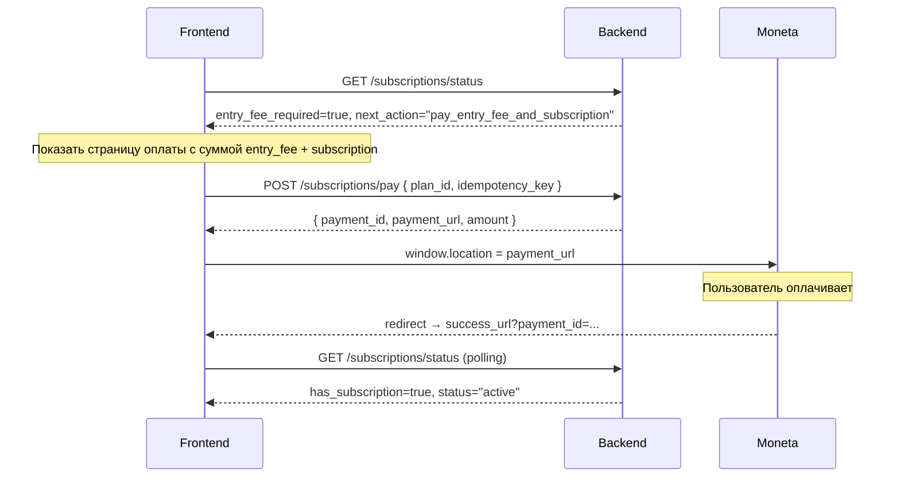
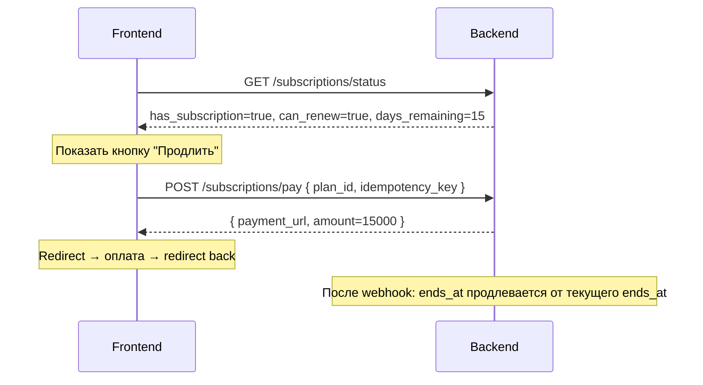

# Frontend Payments & Subscriptions — Handoff Documentation

> **Целевая аудитория:** frontend-разработчик (клиентский сайт + админка).
> **Актуальность:** 2026-03-17. Провайдер: **Moneta** (Moneta.Assistant + BPA PayAnyWay).

---

## Содержание

1. [Общая архитектура](#1-общая-архитектура)
2. [Флоу подписки для врача](#2-флоу-подписки-для-врача)
3. [API подписок (ЛК врача)](#3-api-подписок-лк-врача)
4. [Оплата мероприятия](#4-оплата-мероприятия)
5. [Коллеги (ЛК врача)](#5-коллеги-лк-врача)
6. [Чеки и фискализация](#6-чеки-и-фискализация)
7. [Redirect-flow Moneta](#7-redirect-flow-moneta)
8. [Админка: управление планами](#8-админка-управление-планами)
9. [Админка: платежи и возвраты](#9-админка-платежи-и-возвраты)
10. [Email-уведомления](#10-email-уведомления)
11. [Enum-справочник](#11-enum-справочник)

---

## 1. Общая архитектура

```
Frontend                    Backend                      Moneta
   │                           │                           │
   │  GET /subscriptions/status│                           │
   │ ◄──────────────────────── │                           │
   │                           │                           │
   │  POST /subscriptions/pay  │                           │
   │ ──────────────────────► │  ─── BPA invoice ──────► │
   │  ◄─ { payment_url }       │  ◄── operation_id         │
   │                           │                           │
   │  ── window.location = payment_url ──────────────────► │
   │                           │                           │
   │  ◄──────── redirect to success_url ───────────────── │
   │                           │  ◄── Pay URL webhook      │
   │                           │  ◄── Receipt webhook      │
```

- Бекенд **не** использует iFrame — только redirect.
- Оплата полностью на стороне Moneta. Фронт только открывает `payment_url`.
- После оплаты Moneta редиректит пользователя на `MONETA_SUCCESS_URL` или `MONETA_FAIL_URL`.
- Webhook приходит асинхронно: **статус подписки обновляется в фоне**.
- Фронт должен **поллить** `GET /subscriptions/status` после redirect'а.

---

## 2. Флоу подписки для врача

### 2.1 Первая оплата (вступительный + годовой)



**Что происходит на бекенде:**
- `_determine_product_type` → `ENTRY_FEE` (вступительный + подписка в одном платеже)
- Создаётся invoice с 2 позициями: вступительный + годовой взнос
- После webhook: `Subscription.status` → `active`, `DoctorProfile.status` → `active` (если `approved`)

### 2.2 Продление (только годовой)



**Ключевое:** при продлении `ends_at` считается от **текущего** `ends_at`, а не от `now()`.
Пример: подписка до 2027-01-01, продление 2026-12-01 за 12 мес → `ends_at` = 2028-01-01.

### 2.3 Повторная оплата после длинного перерыва (>60 дней)

Если подписка истекла более 60 дней назад (`LAPSE_THRESHOLD_DAYS`), бекенд считает это "повторным вступлением" и требует вступительный + годовой.

---

## 3. API подписок (ЛК врача)

> Все endpoints: `Authorization: Bearer <access_token>`, роль: `doctor`.

### 3.1 `GET /api/v1/subscriptions/status`

Возвращает полный статус подписки врача.

**Response `200 OK`:**

```json
{
  "has_subscription": true,
  "current_subscription": {
    "id": "uuid",
    "plan": {
      "id": "uuid",
      "code": "annual",
      "name": "Годовой взнос",
      "plan_type": "subscription",
      "price": 15000.0,
      "duration_months": 12
    },
    "status": "active",
    "starts_at": "2026-01-01T00:00:00Z",
    "ends_at": "2027-01-01T00:00:00Z",
    "days_remaining": 295
  },
  "has_paid_entry_fee": true,
  "can_renew": false,
  "next_action": null,
  "entry_fee_required": false,
  "entry_fee_plan": null,
  "available_plans": [
    {
      "id": "uuid",
      "code": "annual",
      "name": "Годовой членский взнос",
      "plan_type": "subscription",
      "price": 15000.0,
      "duration_months": 12
    }
  ]
}
```

**Значения `next_action` и как фронт должен реагировать:**

| `next_action`                     | Описание                                       | Действие фронта                                             |
| --------------------------------- | ---------------------------------------------- | ----------------------------------------------------------- |
| `"pay_entry_fee_and_subscription"` | Первая оплата: вступительный + годовой         | Показать сумму обоих, кнопка "Оплатить"                     |
| `"pay_subscription"`              | Первая подписка (entry_fee уже оплачен)        | Показать выбор плана, кнопка "Оплатить"                     |
| `"renew"`                         | Подписка истекла, нужно продление               | Показать выбор плана, кнопка "Продлить"                     |
| `"complete_payment"`              | Есть незавершённый платёж (pending_payment)     | Показать предупреждение + ссылку на оплату                  |
| `null`                            | Подписка активна, `can_renew` покажет           | Если `can_renew=true` — показать "Продлить" (≤30 дней)      |

**Логика отображения:**

```
if (!has_subscription) {
  if (next_action === "pay_entry_fee_and_subscription") {
    // сумма = entry_fee_plan.price + selected_plan.price
    showEntryFeeAndSubscriptionPayment()
  } else {
    showSubscriptionPayment()
  }
} else if (can_renew) {
  showRenewalOption(current_subscription.days_remaining)
} else {
  showActiveSubscriptionInfo(current_subscription)
}
```

### 3.2 `POST /api/v1/subscriptions/pay`

Создаёт платёж и возвращает URL для оплаты.

**Request:**

```json
{
  "plan_id": "uuid",
  "idempotency_key": "unique-string-per-request"
}
```

> **`idempotency_key`** — уникальная строка (UUID v4 рекомендуется). Повторный запрос с тем же ключом вернёт тот же результат. TTL: 24 часа.

> **`plan_id`** — ID плана типа `subscription` из `available_plans`. Бекенд **автоматически** добавит entry_fee, если нужен.

**Response `201 Created`:**

```json
{
  "payment_id": "uuid",
  "payment_url": "https://moneta.ru/assistant.htm?operationId=12345",
  "amount": 20000.0,
  "expires_at": null
}
```

**Фронт:**
1. Сохранить `payment_id` локально
2. `window.location.href = payment_url`
3. После redirect'а на success_url — начать polling `GET /subscriptions/status`

**Ошибки:**

| HTTP | Код | Причина |
|------|-----|---------|
| 401  | `UNAUTHORIZED` | Не авторизован |
| 403  | `FORBIDDEN` | Нет роли `doctor` |
| 404  | `NOT_FOUND` | План не найден / не активен |
| 422  | `VALIDATION_ERROR` | Нет диплома / entry_fee не настроен |

### 3.3 `GET /api/v1/subscriptions/payments`

**Query params:** `limit` (1–100, default 20), `offset` (≥0, default 0)

**Response:**

```json
{
  "data": [
    {
      "id": "uuid",
      "amount": 20000.0,
      "product_type": "entry_fee",
      "status": "succeeded",
      "description": "Вступительный взнос + Годовой взнос — Ассоциация трихологов",
      "paid_at": "2026-01-15T14:30:00Z",
      "created_at": "2026-01-15T14:25:00Z"
    }
  ],
  "total": 3,
  "limit": 20,
  "offset": 0
}
```

### 3.4 `GET /api/v1/subscriptions/payments/{payment_id}/receipt`

Возвращает чек (фискальный документ) по платежу.

**Response `200 OK`:**

```json
{
  "id": "uuid",
  "receipt_type": "payment",
  "provider_receipt_id": "12345",
  "receipt_url": "https://receipt.moneta.ru/...",
  "fiscal_number": "FN123",
  "fiscal_document": "FD456",
  "fiscal_sign": "FS789",
  "amount": 20000.0,
  "status": "succeeded"
}
```

**404** — чек ещё не готов (BPA receipt webhook ещё не пришёл, может занять до нескольких минут).

---

## 4. Оплата мероприятия

### 4.1 `POST /api/v1/events/{event_id}/register`

Для **авторизованного** пользователя:

```json
{
  "tariff_id": "uuid",
  "idempotency_key": "unique-string",
  "fiscal_email": "user@example.com"
}
```

**Response:**

```json
{
  "registration_id": "uuid",
  "payment_url": "https://moneta.ru/...",
  "applied_price": 3000.0,
  "is_member_price": true
}
```

- `is_member_price: true` — у врача активная подписка, применена льготная цена `member_price`
- `is_member_price: false` — полная цена `price` (гость или подписка неактивна)

Фронт: `window.location.href = payment_url`, после return — polling статуса регистрации.

### 4.2 Гостевая регистрация (без авторизации)

Двухшаговый флоу:

1. `POST /api/v1/events/{event_id}/register` с `guest_email` → ответ `action: "verify_new_email"` или `action: "verify_existing"`
2. `POST /api/v1/events/{event_id}/confirm-guest-registration` с кодом подтверждения → ответ с `payment_url`, `access_token`, `refresh_token`

---

## 5. Коллеги (ЛК врача)

### 5.1 `GET /api/v1/colleagues`

Список врачей с контактными данными. Доступен **только** авторизованным врачам с **активной подпиской**.

**Query params:** `limit` (1–100, default 50), `offset` (≥0), `search` (мин 2 символа)

**Response:**

```json
{
  "data": [
    {
      "id": "uuid",
      "first_name": "Иван",
      "last_name": "Петров",
      "middle_name": "Сергеевич",
      "city": "Москва",
      "specialization": "Трихология",
      "photo_url": "https://cdn.example.com/photos/...",
      "public_phone": "+7 (999) 123-45-67",
      "public_email": "petrov@clinic.ru",
      "colleague_contacts": "Telegram: @petrov_tricho, WhatsApp: +79991234567"
    }
  ],
  "total": 42,
  "limit": 50,
  "offset": 0
}
```

**403** — подписка неактивна или роль не `doctor`.

---

## 6. Чеки и фискализация

Moneta выполняет фискализацию (54-ФЗ) через BPA PayAnyWay.

**Порядок событий:**

1. Пользователь оплачивает → Pay URL webhook → бекенд активирует подписку
2. BPA отправляет receipt webhook (может быть через 1–30 минут) → бекенд сохраняет `receipt_url`
3. Бекенд отправляет email пользователю со ссылкой на чек
4. Пользователь может получить чек через `GET /subscriptions/payments/{id}/receipt`

**Для фронта:**
- Сразу после оплаты чек может быть ещё недоступен (404)
- Показывать "Чек формируется" → retry через 30 сек → показать ссылку, когда 200

---

## 7. Redirect-flow Moneta

### Настроенные URL

| ENV var | Описание | Пример |
|---------|----------|--------|
| `MONETA_SUCCESS_URL` | Redirect после успешной оплаты | `https://trichology.ru/payment/success` |
| `MONETA_FAIL_URL` | Redirect после отмены/ошибки | `https://trichology.ru/payment/fail` |
| `MONETA_RETURN_URL` | Основной return URL | `https://trichology.ru/payment/result` |

### Фронт-страница `/payment/success`

Moneta добавляет `?MNT_TRANSACTION_ID={payment_id}` к success/fail URL.

**Универсальная страница (подписка + билет + взнос):**

1. Извлечь `payment_id` из query (`MNT_TRANSACTION_ID`)
2. Polling `GET /api/v1/subscriptions/payments/{payment_id}/status` каждые 2–3 сек (макс 30 сек)
3. По `product_type` и `status` показать нужное сообщение:
   - `product_type: "subscription" | "entry_fee"`, `status: "succeeded"` → «Подписка активирована!»
   - `product_type: "event"`, `status: "succeeded"` → «Билет оплачен! Мероприятие: {event_title}»
4. При `status: "pending"` — «Обработка платежа…»
5. При `status: "failed"` / `"expired"` — «Оплата не прошла»

**Ответ `GET /subscriptions/payments/{id}/status` (публичный, без auth):**

```json
{
  "payment_id": "uuid",
  "status": "pending" | "succeeded" | "failed" | "expired",
  "product_type": "entry_fee" | "subscription" | "event",
  "amount": 10000.00,
  "created_at": "...",
  "paid_at": null,
  "event_id": "uuid",
  "event_title": "Конференция 2026"
}
```

`event_id`, `event_title` — только для `product_type === "event"`.

### Фронт-страница `/payment/fail`

1. Показать "Оплата не прошла"
2. Кнопка "Попробовать снова" → `GET /subscriptions/status` → показать форму оплаты

---

## 8. Админка: управление планами

### 8.1 CRUD планов

| Endpoint | Метод | Описание |
|----------|-------|----------|
| `/api/v1/admin/settings/plans` | GET | Список всех планов |
| `/api/v1/admin/settings/plans` | POST | Создать план |
| `/api/v1/admin/settings/plans/{id}` | PATCH | Обновить план |
| `/api/v1/admin/settings/plans/{id}` | DELETE | Удалить (если нет активных подписок) |

**POST / PATCH body:**

```json
{
  "code": "annual",
  "name": "Годовой членский взнос",
  "description": "Ежегодный взнос для членства",
  "price": 15000.0,
  "duration_months": 12,
  "is_active": true,
  "sort_order": 0,
  "plan_type": "subscription"
}
```

**Типы планов (`plan_type`):**
- `"entry_fee"` — вступительный взнос (должен быть ровно один активный)
- `"subscription"` — годовой / полугодовой членский взнос

---

## 9. Админка: платежи и возвраты

### 9.1 Список платежей

`GET /api/v1/admin/payments`

Query: `status`, `product_type`, `user_id`, `limit`, `offset`

### 9.2 Ручное подтверждение платежа

`POST /api/v1/admin/payments/manual`

```json
{
  "user_id": "uuid",
  "amount": 20000.0,
  "product_type": "entry_fee",
  "description": "Оплата наличными на конференции",
  "plan_id": "uuid"
}
```

### 9.3 Возврат

`POST /api/v1/admin/payments/{payment_id}/refund`

```json
{
  "amount": 15000.0,
  "reason": "Ошибочная оплата"
}
```

> Для Moneta автоматический возврат **не поддерживается**. Бекенд вернёт ошибку с инструкцией использовать ЛК провайдера.

---

## 10. Email-уведомления

Бекенд автоматически отправляет:

| Событие | Когда |
|---------|-------|
| Оплата успешна | Сразу после webhook |
| Чек готов | После receipt webhook (1–30 мин) |
| Ошибка оплаты | При cancel webhook |
| Подписка истекает | За 30 / 7 / 3 / 1 день (cron) |
| Профиль одобрен + нужна оплата | После модерации |

---

## 11. Enum-справочник

### Subscription statuses

| Значение | Описание |
|----------|----------|
| `pending_payment` | Создана, ожидает оплату |
| `active` | Действующая |
| `expired` | Истекла (cron каждый час) |

### Payment statuses

| Значение | Описание |
|----------|----------|
| `pending` | Ожидает оплату |
| `succeeded` | Оплачено |
| `failed` | Отклонено / отменено |
| `refunded` | Возврат |

### Product types

| Значение | Описание |
|----------|----------|
| `entry_fee` | Вступительный + годовой (первый платёж) |
| `subscription` | Только годовой (продление) |
| `event` | Оплата мероприятия |

### next_action values

| Значение | Описание |
|----------|----------|
| `pay_entry_fee_and_subscription` | Нужен вступительный + членский |
| `pay_subscription` | Нужен только членский |
| `renew` | Подписка истекла |
| `complete_payment` | Есть незавершённый платёж |
| `null` | Активная подписка, ничего не нужно |
