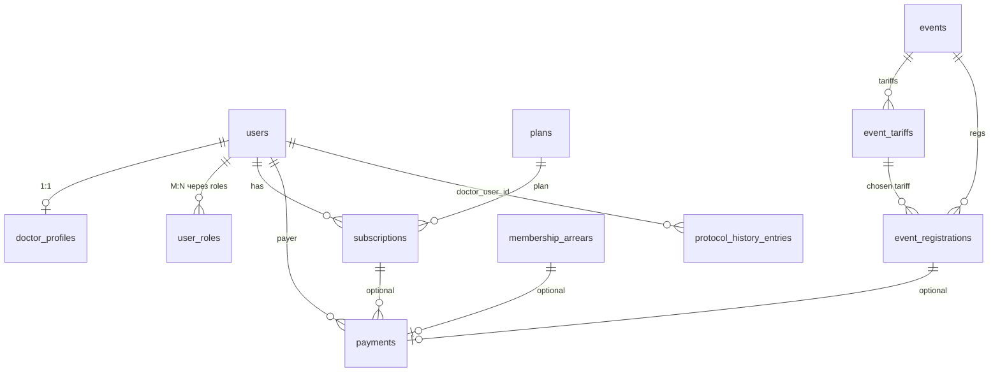

# Контекст выгрузок данных (бухгалтерия и админы)

Документ описывает, **какие сущности и поля есть в базе** проекта trihoback, как они связаны, и **как разумнее собрать таблицы** для отчётности без «поиска только по UUID». Реализация API/скриптов выгрузки — отдельная задача; здесь — справочник по моделям и рекомендации по колонкам.

---

## 1. Общая схема связей (упрощённо)

- **Пользователь** (`users`) — логин, email, пароль; **внутренняя почта** для входа — это `users.email`.
- **Врач** — строка в `doctor_profiles` с `user_id` (один профиль на пользователя). ФИО и телефон врача — в профиле, не в `users`.
- **Роли** — таблицы `roles`, `user_roles` (связь пользователь ↔ роль). Доступные значения роли в enum: `admin`, `manager`, `accountant`, `doctor`, `user`.
- **Подписка** — `subscriptions` (план `plans`, период `starts_at` / `ends_at`, статус).
- **Платёж** — `payments`; тип товара `product_type`; привязка к подписке, регистрации на событие или задолженности — через FK.
- **Регистрация на мероприятие** — `event_registrations` + тариф `event_tariffs` + событие `events`.
- **Задолженность** — `membership_arrears` (год, сумма, статус).
- **Протоколы** — только журнал решений: `protocol_history_entries` (не отдельная сущность «текст протокола PDF», а **записи** о приёме/исключении по врачу).

---

## 2. Пользователи и роли

### Таблица `users`

| Поле | Тип смысла | Комментарий |
|------|------------|-------------|
| `id` | UUID | PK |
| `email` | строка | Учётная почта (логин), для выгрузок — основной «человеческий» идентификатор вместе с ФИО |
| `is_active` | bool | Аккаунт активен |
| `email_verified_at` | datetime \| null | Подтверждение email |
| `created_at` | datetime | Регистрация аккаунта |
| `deleted_at` / `is_deleted` | soft delete | Учитывать при «все пользователи» |

Роли: **`user_roles`** — пары `(user_id, role_id)`; название роли в **`roles.name`** (enum как выше). У одного пользователя может быть несколько ролей.

**Рекомендация для выгрузки «все пользователи»:** колонки  
`user_id`, `email`, `roles` (строка через запятую или отдельная строка на пару user–роль), `is_active`, `created_at`.  
ФИО/телефон — из `doctor_profiles`, если профиль есть (см. §3).

---

## 3. Врачи (`doctor_profiles`)

| Поле | Комментарий |
|------|-------------|
| `user_id` | FK → `users.id` (unique) |
| `first_name`, `last_name`, `middle_name` | ФИО |
| `phone` | Телефон (обязателен в бизнес-правилах онбординга) |
| `status` | Enum **DoctorStatus**: `pending_review`, `approved`, `rejected`, `active`, `deactivated` |
| `public_email`, `public_phone` | Публичные контакты на сайте (могут отличаться от учётной почты) |
| `city_id` | Город (справочник `cities`) |
| `slug` | URL-карточки |
| `board_role` | Роль в правлении (если задана): `pravlenie`, `president` |
| `entry_fee_exempt` | Освобождение от вступительного взноса |
| `membership_excluded_at` | Дата исключения из членства (если заполнено — учитывать в отчётах по «активным») |
| `created_at`, `updated_at` | Аудит |
| `is_deleted`, `deleted_at` | Soft delete профиля |

**«Актуальные активные врачи в ассоциации»** в типичном смысле:  
- `doctor_profiles.status = 'active'`  
- профиль не удалён (`is_deleted` учитывать)  
- при необходимости дополнительно: не исключён (`membership_excluded_at IS NULL`), активная подписка на конец периода — через `subscriptions` (см. §4).

Уточняйте у бизнеса определение «активный член»: только статус профиля или ещё и оплаченный год / подписка.

---

## 4. Подписки и планы

### `plans`

| Поле | Комментарий |
|------|-------------|
| `code`, `name` | Код и название тарифа |
| `price` | Цена |
| `duration_months` | Длительность |
| `plan_type` | По умолчанию `subscription`; есть `entry_fee` для вступительного |

### `subscriptions`

| Поле | Комментарий |
|------|-------------|
| `user_id` | Владелец |
| `plan_id` | FK → `plans` |
| `status` | **SubscriptionStatus**: `active`, `expired`, `pending_payment`, `cancelled` |
| `starts_at`, `ends_at` | Период действия (для отчётов «активна на дату» сравнивать с `ends_at`) |
| `is_first_year` | Первый год / продление |

**Фильтр «подписка активна»:**  
`status = 'active'` и (обычно) `ends_at > now()` или `ends_at IS NULL` — в коде проверять так же, как в сервисах.

---

## 5. Платежи (`payments`)

| Поле | Комментарий |
|------|-------------|
| `id` | UUID платежа |
| `user_id` | Кто платил (всегда заполнен) |
| `amount` | Сумма |
| `status` | **PaymentStatus**: `pending`, `succeeded`, `failed`, `expired`, `partially_refunded`, `refunded` |
| `product_type` | **ProductType**: см. ниже |
| `payment_provider` | `yookassa`, `moneta`, `manual`, и т.д. |
| `subscription_id` | Если оплата членского / вступительного через подписку |
| `event_registration_id` | Если оплата за мероприятие |
| `arrear_id` | Если оплата задолженности |
| `external_payment_id`, `moneta_operation_id` | Идентификаторы у провайдера |
| `paid_at` | Факт оплаты |
| `created_at` | Создание платежа в системе |
| `description` | Текстовое описание (если заполнялось) |

**Смысл `product_type` для отчётов:**

| Значение | Объект оплаты |
|----------|----------------|
| `entry_fee` | Вступительный взнос (связь с подпиской/планом через `subscription_id` → `plans`) |
| `subscription` | Членский взнос / продление (то же) |
| `event` | Мероприятие (`event_registration_id` → регистрация → событие + тариф) |
| `membership_arrears` | Старая задолженность (`arrear_id` → `membership_arrears`) |

**Рекомендуемые колонки выгрузки «все платежи»:**

1. Идентификаторы: `payment_id`, `external_payment_id` (если есть).  
2. **Статус** и `paid_at`, `created_at`.  
3. **Сумма**, провайдер.  
4. **Тип продукта** (`product_type`) + **человекочитаемое описание объекта** (собрать из JOIN):  
   - для subscription/entry_fee: название плана (`plans.name`), код плана, сумма из плана при необходимости;  
   - для event: `events.title`, дата события, название тарифа `event_tariffs.name`, тип цены (см. §6);  
   - для arrears: год задолженности, сумма строки arrears.  
5. **Плательщик:** `users.email`, ФИО из `doctor_profiles` (если есть), иначе только email.  
6. Ссылка на чек: через `receipts` по `payment_id` (`receipt_url`, статус фискализации).

---

## 6. Регистрации на мероприятия (`event_registrations`)

Связь: `user_id` + `event_id` + `event_tariff_id` (уникальная тройка).

| Поле | Комментарий |
|------|-------------|
| `status` | **EventRegistrationStatus**: `pending`, `confirmed`, `cancelled` |
| `applied_price` | Цена в момент регистрации |
| `is_member_price` | `true` — применена цена для члена ассоциации; `false` — цена «как не член» (для отчёта «участник / не участник» по тарифу) |
| `guest_full_name`, `guest_email`, … | Данные гостя, если регистрация оформлена не на себя (уточнять бизнес-смысл в продукте) |
| `fiscal_email` | Email для чека |
| `created_at` | Дата регистрации |

**Из `events`:** `title`, `event_date`, `event_end_date`, `status` (события).  
**Из `event_tariffs`:** `name`, `price`, `member_price`, `description` (название тарифа и цены).

**Связь с оплатой:** по `payments.event_registration_id = event_registrations.id` (для успешных отчётов — `payments.status = 'succeeded'`).

**Рекомендуемая выгрузка для отчётности по мероприятиям:**

| Колонка | Источник |
|---------|----------|
| Регистрация | `event_registrations.id`, `created_at`, `status` |
| Событие | `events.title`, `events.event_date`, `events.slug` |
| Тариф | `event_tariffs.name`, `applied_price`, `is_member_price` |
| Пользователь | `users.id`, `users.email` |
| ФИО врача | `doctor_profiles` по `user_id` |
| Платёж | сумма, статус, `paid_at`, `payment_id` из связанного `payments` |
| Тип участия | вывести из `is_member_price` + при необходимости гостевые поля |

Так бухгалтер видит **тариф, факт оплаты и врача/пользователя** без ручного поиска по UUID.

---

## 7. Задолженности (`membership_arrears`)

| Поле | Комментарий |
|------|-------------|
| `user_id` | Должник |
| `year` | Календарный год задолженности |
| `amount` | Сумма |
| `description` | Текст основания |
| `admin_note` | Внутренняя заметка |
| `status` | **ArrearStatus**: `open`, `paid`, `cancelled`, `waived` |
| `source` | `manual` / автоматические сценарии (строка в модели) |
| `payment_id` | Какой платёж закрыл (если `paid`) |
| `paid_at`, `waived_at`, `waive_reason` | Закрытие списанием / оплатой |
| `created_at`, `updated_at` | Аудит |

**Выгрузка для админов/бухгалтерии:**  
`arrear_id`, `status`, `year`, `amount`, `description`,  
плюс **`users.email`**, **`doctor_profiles.last_name/first_name/middle_name`**, **`doctor_profiles.phone`**,  
плюс при оплате — сумма/дата из `payments` по `payment_id`.

---

## 8. Протоколы (`protocol_history_entries`)

Это **не** хранилище полного текста протокола заседания, а **журнал записей** по врачу.

| Поле | Комментарий |
|------|-------------|
| `year` | Год |
| `protocol_title` | Название/номер протокола (строка до 500 символов) |
| `notes` | Примечания |
| `doctor_user_id` | Врач (FK → `users.id`) |
| `action_type` | `admission` или `exclusion` |
| `created_by_user_id`, `last_edited_by_user_id` | Кто создал/редактировал |
| `created_at`, `updated_at` | Время |

**Отдельная выгрузка «все протоколы»** = все строки этой таблицы + **ФИО и email** через join на `users` и `doctor_profiles` по `doctor_user_id`.

**Выгрузка «активные врачи + история протоколов»:**  
- отфильтровать врачей по §3;  
- для каждого `user_id` врача подтянуть все строки `protocol_history_entries` где `doctor_user_id = user_id`;  
- можно двумя листами Excel: лист «врачи», лист «протоколы» с колонкой `doctor_user_id` для связи.

---

## 9. Сопоставление ваших 5 выгрузок с таблицами БД

| Запрос | Таблицы (минимум) |
|--------|-------------------|
| 1. Все платежи | `payments` LEFT JOIN `users` LEFT JOIN `doctor_profiles` ON user_id; LEFT JOIN `subscriptions` + `plans` для entry/subscription; LEFT JOIN `event_registrations` + `events` + `event_tariffs` для event; LEFT JOIN `membership_arrears` для arrears; `receipts` по необходимости |
| 2. Регистрации на мероприятия | `event_registrations` JOIN `events` JOIN `event_tariffs` JOIN `users` JOIN `doctor_profiles` (optional) LEFT JOIN `payments` |
| 3. Активные врачи + протоколы | `doctor_profiles` + фильтры + `protocol_history_entries` ON `doctor_user_id` = `users.id` |
| 4. Список всех записей протоколов | `protocol_history_entries` + user/doctor контакты |
| 5. Задолженности | `membership_arrears` JOIN `users` JOIN `doctor_profiles` |

---

## 10. Рекомендации по оформлению файлов (Excel/CSV)

1. **Всегда дублировать человекочитаемые поля:** `email`, ФИО, телефон рядом с `user_id` / `payment_id`.  
2. **Статусы** выгружать **как в БД** + при желании отдельная колонка «по-русски» для бухгалтерии.  
3. **Денежные суммы** — числом; **даты** — в ISO или с явным часовым поясом (в БД часто `timestamptz`).  
4. **Один тип продукта — один блок колонок** или **длинный формат** (одна строка на платёж с универсальными колонками «название объекта», «дата события», «год задолженности» — что не относится к строке, оставлять пустым).  
5. **Роли:** для фильтра либо столбец `roles_concat`, либо отдельная таблица «user_id — role».  
6. **Не смешивать** в одной строке разные сущности без подписи (например платёж и две регистрации).

---

## 11. Ограничения и пробелы

- **«Тип регистрации: участник ассоциации или просто пользователь»** в данных мероприятия отражается через **`is_member_price`** (тариф члена vs не члена) и роль `doctor`; однозначная трактовка — за продуктом.  
- **Внутренняя почта** = `users.email`; публичная у врача может быть **`doctor_profiles.public_email`**.  
- Полный текст протокола PDF в отдельной таблице **не хранится** — только **`protocol_history_entries`**.  
- История платежей по одной подписке — несколько строк `payments` с одним `subscription_id`.

---

## 12. Где смотреть код моделей

- Платежи, подписки, планы, чеки: [`backend/app/models/subscriptions.py`](../../backend/app/models/subscriptions.py)  
- События, тарифы, регистрации: [`backend/app/models/events.py`](../../backend/app/models/events.py)  
- Задолженности: [`backend/app/models/arrears.py`](../../backend/app/models/arrears.py)  
- Врачи: [`backend/app/models/profiles.py`](../../backend/app/models/profiles.py)  
- Протоколы: [`backend/app/models/protocol_history.py`](../../backend/app/models/protocol_history.py)  
- Пользователи и роли: [`backend/app/models/users.py`](../../backend/app/models/users.py)  
- Перечисления: [`backend/app/core/enums.py`](../../backend/app/core/enums.py) и enum в [`backend/app/models/base.py`](../../backend/app/models/base.py)

Этого достаточно, чтобы **самостоятельно** спроектировать столбцы CSV/XLSX и SQL-запросы под ваши отчёты; при появлении админ-endpoint’ов выгрузки их можно описать в отдельном handoff, ссылаясь на этот документ.
